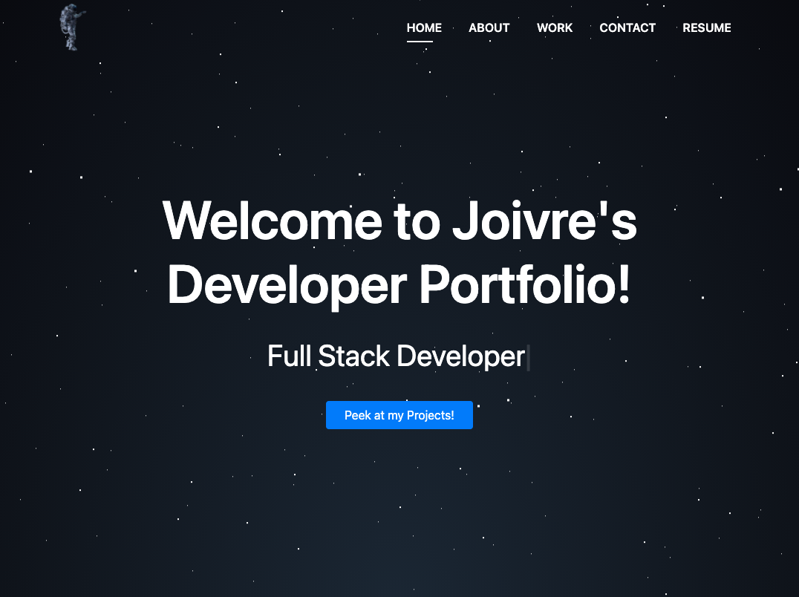
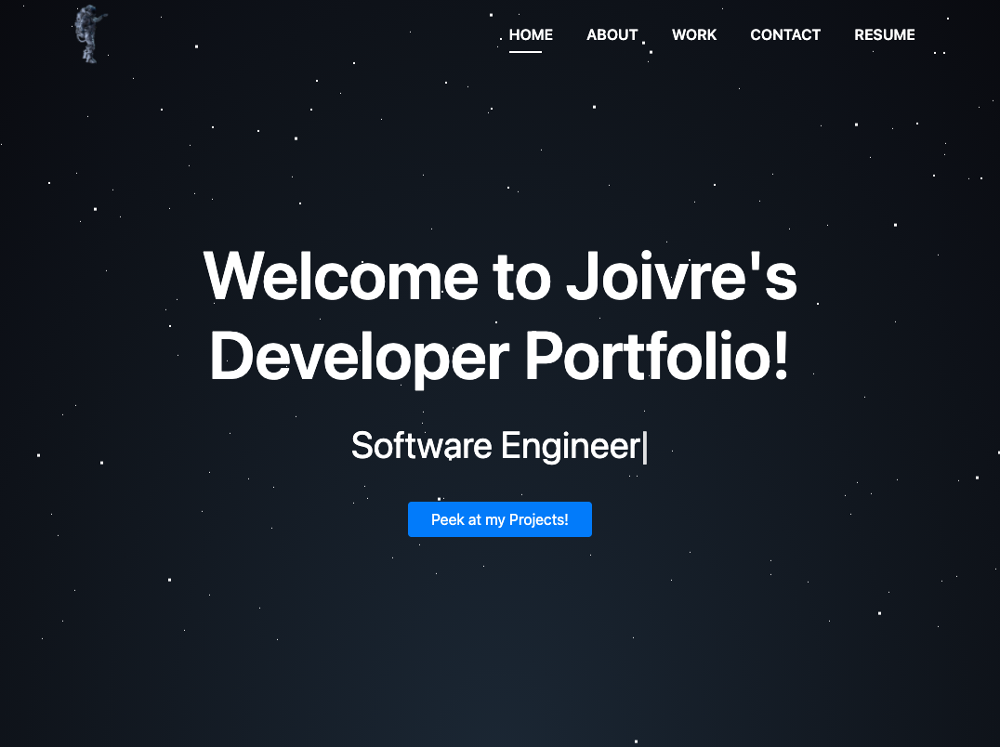
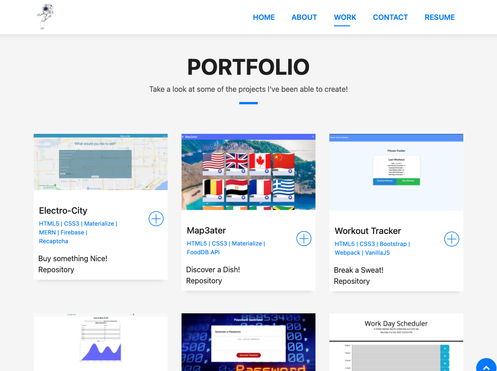
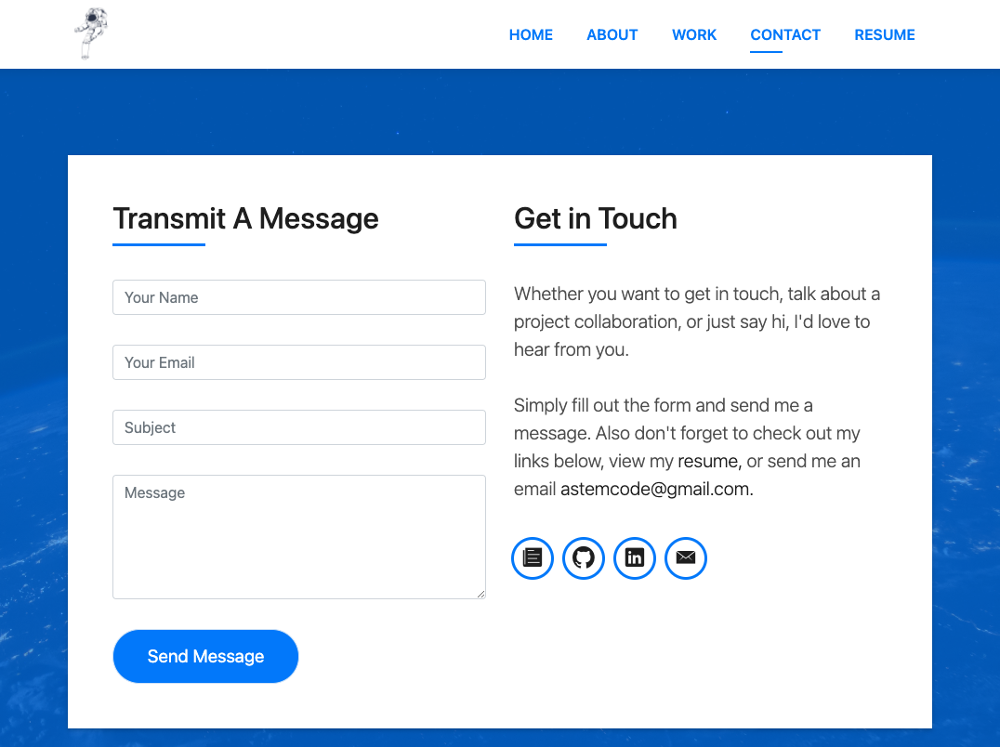

# React Portfolio

## Description 
- A portfolio utilizing React to assist in displaying a portion of my personal projects and professional documentation.

* [Usage](#usage)
* [Contributing](#contributors)
* [Installation](#installation)
* [Badges](#badges)
* [Author](#author)

## Usage
- Display of my personal and professional projects to share with developer peers.
- Heres a link to the deployed site:
    - [aStemCode](www.astemcode.com)

1. Homepage

2. Shifted Text

3. Projects

4. Contact

## Installation
- To install the project follow the following instructions:
*The client will need to clone the repository to their local device. Once this is completed the will need to input the command `npm i` to install all of the necessary packages.

## Badges

## Author
- Joivre Charles
- Github: [aStemCode](https://github.com/astemcode)
- Email: [aStemCode](astemcode@gmail.com)
